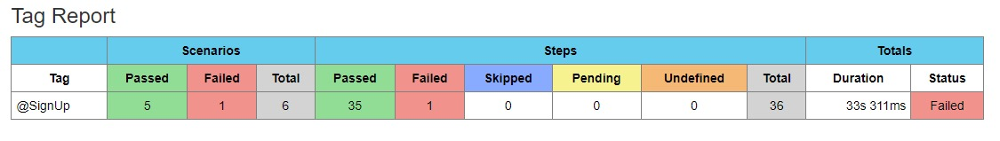
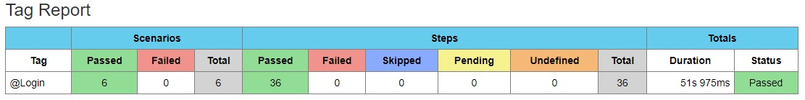
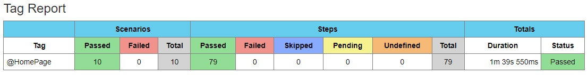
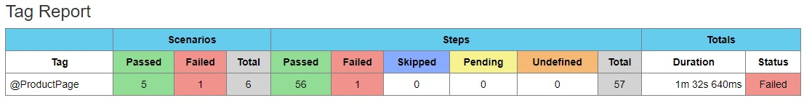
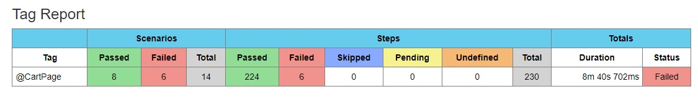

# WEB Automation Testing : Demoblaze

## About

[Demoblaze](https://www.demoblaze.com/) is a website that provides a demo e-commerce platform where users can browse products, add them to cart, and perform other typical e-commerce activities.

## Test Documentation

Test Documentation Web Testing can access [here](https://docs.google.com/spreadsheets/d/1rZZAaj-qHi45TKIWrrW-3dk6EF34YTvmw3OFCM-BK5E/edit?usp=sharing).

## Test Report
#### - Sign Up Page


#### - Login Page


#### - Home Page


#### - Product Page


#### - Cart Page


## Tools & Tech Stack
- [Java 8](https://www.oracle.com/java/technologies/downloads/#java8)
- [Selenium](https://www.selenium.dev/)
- [SerenityBDD](https://serenity-bdd.info/)
- [IntelliJ IDEA](https://www.jetbrains.com/idea/download/)
- IntelliJ IDEA Plugins :  [Cucumber for Java](https://plugins.jetbrains.com/plugin/7212-cucumber-for-java), [Gherkin](https://plugins.jetbrains.com/plugin/9164-gherkin)
- [Maven](https://maven.apache.org/download.cgi)

## Installation
- Install  [Java 8](https://www.oracle.com/java/technologies/downloads/#java8) and [Maven](https://maven.apache.org/download.cgi) on your device
- We recommended you run this project in IntelliJ IDEA and make sure to install Maven and Cucumber for Java and Gherkins first
- Clone project on your device
```
git clone https://github.com/sofiemiranti/DemoblazeAutomation.git
```
- Open IntelliJ IDEA and the project on your device
- For Run Automation Testing
```
mvn clean test
```
